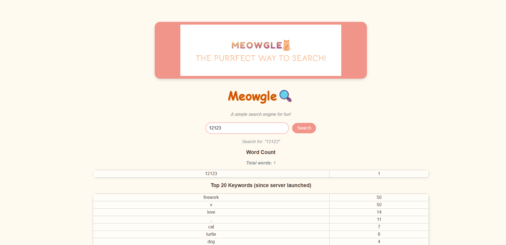

# ECE326-Web-Search-Engine
A [web search engine](https://github.com/TszTungChau-Jo/ECE326-Web-Search-Engine) that resembles the Google search engine.

Author: Joshua Chau, Lynne Liu

## Search engine description
Frontend: You could open up a website and input anything in the search bar. The search bar will count how many times each word occur, and store in history. 
The website should show our logo and search engine name, two tables after search, and the cursor could turn into cat automatically within the web page. 

### Name
Meowgle ('Meow' + Google)

### Our logo


## LAB2: Frontend


## LAB2: Backend


## LAB2: Benchmark Setup

### Environment
- **Client machine:** Local WSL2 terminal (Ubuntu on Windows 11) — used to send ApacheBench requests  
- **Server machine:** AWS EC2 `t3.micro` instance (1 vCPU, 1 GiB RAM, 8 GB EBS root volume)  
- **OS:** Ubuntu 22.04 LTS  
- **App:** Bottle web server (`WSGIServer/0.2`) serving the `/` endpoint in anonymous mode  
- **Benchmark tools used:**
  - `ab` (ApacheBench) — measure throughput, latency, and concurrency  
  - `dstat -cdnm 1` — monitor CPU, disk I/O, network, and memory utilization  

---

### Network Setup
The client connects to the EC2 server using an **SSH tunnel** that forwards port 8080 from the remote instance to the local machine.  
This allows ApacheBench on the local computer to benchmark `http://localhost:8080` as if the web app were running locally.

**Command (run on local machine):**
```bash
ssh -i ~/.ssh/ece326-group3-joshua-key.pem \
    -o IdentitiesOnly=yes -o ExitOnForwardFailure=yes \
    -N -f -L 8080:localhost:8080 ubuntu@3.87.252.156
```

Explanation:

* -i ~/.ssh/ece326-group3-joshua-key.pem → specify private key

* -L 8080:localhost:8080 → forward local 8080 to remote 8080

* -N → no remote command (tunnel only)

* -f → run in background

* -o ExitOnForwardFailure=yes → exit if tunnel cannot be established

After running this, the web app hosted on the EC2 instance (port 8080) becomes accessible from http://localhost:8080 on the local machine.

Benchmark Procedure
1. Launch the server on the EC2 instance

```bash
python3 main.py
```
2. On the local machine, open the SSH tunnel (command above).

3. Run ApacheBench load tests from local terminal:

```bash
for c in 10 12 15 18 20 22 23 24 25 26 28 30; do
  echo "=== concurrency $c ==="
  ab -n 10000 -c $c http://localhost:8080/ | tee ab_c${c}_10k.log
done
```

4. Identify maximum concurrency before drops (c = 28), then run a sustained load test:

```bash
ab -n 20000 -c 28 http://localhost:8080/ | tee ab_max2.log
```

5. Monitor resource utilization on the EC2 instance (in another SSH session):

```bash
dstat -cdnm 1 | tee dstat.log
```

6. Stop the tunnel after testing:

```bash
pkill -f "ssh.*8080:localhost:8080"
```

## LAB1: How to run the front end
```
python -m http.server 8000
```

Then open http://localhost:8000/ locally



### Files
img: Stores all images needed; Our logo, cursor, and web picture.

Important file for frontend: index.html, style.css, img, HelloWorld.py


## LAB1: Backend Design

### Overview
The backend extends on the given web crawler starter to index web pages and build an inverted index for efficient keyword search. The crawler visits URLs, extracts content, and maintains data structures that map words to the documents containing them.

### Main Data Structures

**1. Document Index (`_doc_index`)**
- **Type:** `dict[int, dict[str, str]]`
- **Purpose:** Stores metadata for each crawled document
- **Structure:** Maps document ID → {url, title, desc}
- **Example:**
  ```python
  {
    1: {
      "url": "http://google.com",
      "title": "Google",
      "desc": "Search the world's information..."
    }
  }
  ```

**2. Inverted Index (`_inverted_index`)**
- **Type:** `dict[int, set[int]]`
- **Purpose:** Maps word IDs to the set of documents containing that word
- **Structure:** word_id → set(doc_ids)
- **Example:**
  ```python
  {
    1: {1, 2, 3},  # "google" appears in docs 1, 2, 3
    2: {1, 4}      # "search" appears in docs 1, 4
  }
  ```

**3. Lexicon (`_word_id_cache`)**
- **Type:** `dict[str, int]`
- **Purpose:** Maps each unique word to a unique word ID
- **Structure:** word → word_id
- **Example:**
  ```python
  {
    "google": 1,
    "search": 2,
    "engine": 3
  }
  ```

**4. Document ID Cache (`_doc_id_cache`)**
- **Type:** `dict[str, int]`
- **Purpose:** Prevents duplicate crawling by tracking all seen URLs
- **Structure:** url → doc_id

### Required Functionality 1: get_inverted_index()

**Purpose:** Returns the inverted index with word IDs and document IDs

**Return Type:** `dict[int, set[int]]`

**Behavior:**
- Returns a shallow copy of the internal inverted index
- Prevents external modifications from corrupting internal state
- Maps word_id → set of doc_ids where the word appears

**Example Usage:**
```python
bot = crawler(None, "urls.txt")
bot.crawl(depth=0)
index = bot.get_inverted_index()
# Returns: {1: {1, 2}, 2: {1, 3}, ...}
```

### Required Functionality 2: get_resolved_inverted_index()

**Purpose:** Returns the inverted index with actual words and URLs instead of IDs

**Return Type:** `dict[str, set[str]]`

**Behavior:**
- Translates word IDs to actual words using the lexicon
- Translates document IDs to URLs using the document index
- Returns a human-readable version of the inverted index
- Only includes words and documents that were successfully indexed

**Example Usage:**
```python
bot = crawler(None, "urls.txt")
bot.crawl(depth=0)
resolved = bot.get_resolved_inverted_index()
# Returns: {
#   "google": {"http://google.com", "http://google.ca"},
#   "search": {"http://google.com", "http://bing.com"}
# }
```

### Running the Backend

**Crawl URLs:**
```bash
python crawler.py
```

**Run Unit Tests:**
```bash
python -m unittest -v test_crawler_lab1.py
```

**Expected Output:**
```
test_get_inverted_index_returns_dict ... ok
test_inverted_index_structure ... ok
test_get_resolved_inverted_index_returns_dict ... ok
test_resolved_index_structure ... ok
test_doc_index_has_required_fields ... ok
test_descriptions_exist ... ok
test_ignored_words_filtered ... ok

Ran 7 tests in 0.5s
OK
```

### Files

**Important files for backend:**
- `crawler.py` - Main crawler implementation with indexing logic
- `test_crawler_lab1.py` - Unit tests verifying crawler functionality
- `urls.txt` - Seed URLs for the crawler to start from
- `requirements.txt` - Python dependencies (BeautifulSoup, etc.)